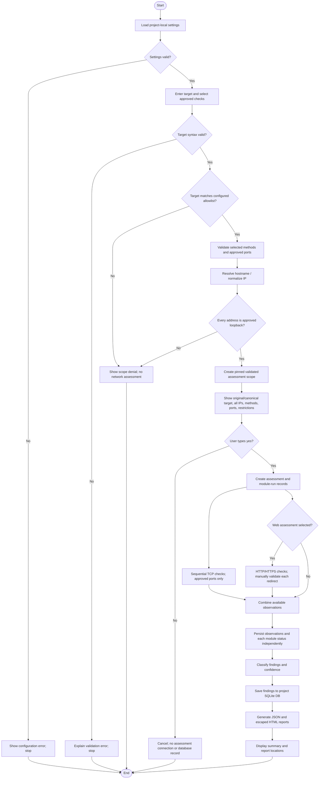

# Application Workflow Diagram

```mermaid
flowchart TD
    Start([Start]) --> Load[Load project-local settings]
    Load --> SettingsOK{Settings valid?}
    SettingsOK -- No --> ConfigError[Show configuration error; stop]
    SettingsOK -- Yes --> Input[Enter target and select approved checks]
    Input --> Syntax{Target syntax valid?}
    Syntax -- No --> InputError[Explain validation error; stop]
    Syntax -- Yes --> PreAllow{Target matches configured allowlist?}
    PreAllow -- No --> Deny[Show scope denial; no network assessment]
    PreAllow -- Yes --> Methods[Validate selected methods and approved ports]
    Methods --> Resolve[Resolve hostname / normalize IP]
    Resolve --> Addresses{Every address is approved loopback?}
    Addresses -- No --> Deny
    Addresses -- Yes --> Pin[Create pinned validated assessment scope]
    Pin --> Review[Show original/canonical target, all IPs, methods, ports, restrictions]
    Review --> Confirm{User types yes?}
    Confirm -- No --> Cancel[Cancel; no assessment connection or database record]
    Confirm -- Yes --> Create[Create assessment and module-run records]
    Create --> TCP[Sequential TCP checks; approved ports only]
    Create --> WebSelected{Web assessment selected?}
    WebSelected -- Yes --> HTTP[HTTP/HTTPS checks; manually validate each redirect]
    WebSelected -- No --> Combine[Combine available observations]
    TCP --> Combine
    HTTP --> Combine
    Combine --> Persist[Persist observations and each module status independently]
    Persist --> Classify[Classify findings and confidence]
    Classify --> Save[Save findings to project SQLite DB]
    Save --> Reports[Generate JSON and escaped HTML reports]
    Reports --> Summary[Display summary and report locations]
    Summary --> End([End])
    ConfigError --> End
    InputError --> End
    Deny --> End
    Cancel --> End
```

Every redirect repeats destination validation and address pinning. An unsafe redirect is recorded as blocked, not followed.
